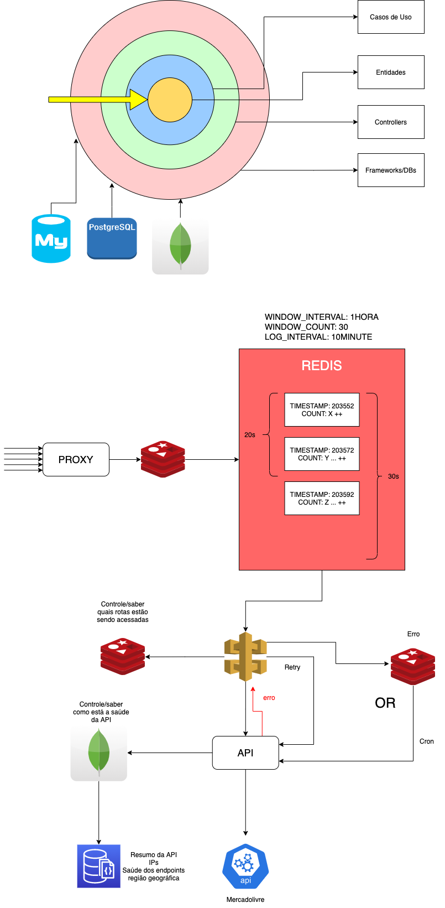

# Mercadolivre Proxy Project

## Steps to start this project:
### Go to main folder and execute the steps below:

- `npm run setup`: to setup initial project's configuration (If you don't have nvm installed follow this instructions: https://github.com/nvm-sh/nvm)
- download redis image `docker pull redis`
- download mongodb image `docker pull mongo`
- run `docker-compose up`
- run `npm run dev`

**Some routes to test are in the `requests.rest` file. To fire the request just hit `send request` right on top of the URI you are trying to access.**

### Project Design Architecture

```
├── _controllers
├── _entities
├── _use-cases
├── api (api routing system)
├── builders (factory instance)
├── filters (arrays, objects and data filters)
├── helper (used to provide easier access to external libraries)
├── middleware
├── mocks
├── mongo
├── validators
```

The project was made having the **clean architecture** in mind: https://blog.cleancoder.com/uncle-bob/2012/08/13/the-clean-architecture.html. This approach was used to take the most out of the business logic by separating concerns. This architecture allows every component to be scalable by:

- Having it's own responsibility.
- Being opened for incremental changes
- Being modular
- Testable
- Independent of UI
- Independent of DB

Having this in mind, the architecture was separated into 3 main concepts:

- Entities: Encapsulating the **inner business logic of a company**. It may return an object or a data structure representing an entity. Examples: 
  - customer
  - purchase
  - order
  - account
- Use-cases: By having entities, now we need use-cases for them that will implement how to deal with them by having **application specific** business rules. Examples: 
  - retrieveCustomer()
  - retrieveCustomerByAddress()
  - createPurchase()
  - updateAccount()
- The last but not least concept is the controller. It is the responsible for managing the requests and response of the API call to the user, it will set the headers, get the body, return an error with specific codes and messages.

### Proxy Architecture Solution



### Description and reason behind architecture

The project was made having in mind scalability, maintainability, and resilience.
Here is the job flow of what is happening under the hood:

Imagining that the proxy could receive thousands of requests a day, this is why a rate limiter algorithm was implemented using Redis as a middleware of the application.

## Rate Limitter

Among many existing alogirithms, I decided to implement `sliding window algorithm`.

This algorithm was made using Redis to persist the data of the request and validating if the user can proceed or not.

sliding window algorithm: User requests are grouped by timestamp. By 10 seconds window for example:

```
{
  timestamp: 21224325
  requestCount: 3
}
{
  timestamp: 21224335
  requestCount: 2
}
{
  timestamp: 21224345
  requestCount: 5
}
```

Whenever the requestCount hits the maximum in a configured sized window time, it sends back the response: 
`You have exceeded the ${MAX_WINDOW_REQUEST_COUNT} requests in ${WINDOW_SIZE_IN_SECONDS} secs limit!`.

## Queue

After it passes the rate limit test, it will go straight to a queue that will evaluate body/header content. Not only that but depending on the route, if we have some error during the request (mercadolivre api can be unavailable), we can ask the queue to retry 1 or 2 times before actually sending the error back to the user. Also, the queue is important to not overload the server with requests, preventing the server to go down.

Another option could be to save the responses to a cache (much faster to write and read) database like redis and use cron worker that would retries after X minutes. Even though the first option is more intuitive and cleaner.

## Saving data to Mongo

- Since the data we are saving does not have many relationships, I believe a nosql table like Mongodb would be the most recommended solution for that case. Every response I get back, I send it to a Mongodb collection called `requests` so we have our analytics interface about the requests made.

This mongo data can have a lifecycle of 3 months and every 5 hours the data from mongo could be sent to a mysql database to provide a summary of the requests. In this case the data could be more readable, there are more visualization tools to analyze the data that supports relational databases and we could isolate the service.

## Further steps...

### **Kubernets**
To scalate even more, we could think about configuring Kubernetes to increase the capacity of the server, being able to take in much more requests and also improving response time by having many others instances of the server up and running.
### **Load balancer**
Along with Kubernetes a load balancer (nginx for example) could be configured to manage the requests and limit request overload and distributing it across different server instances
